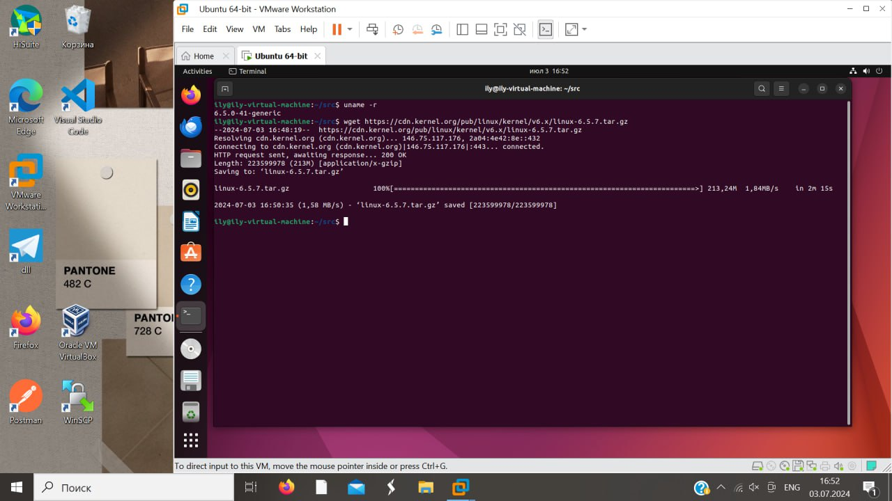
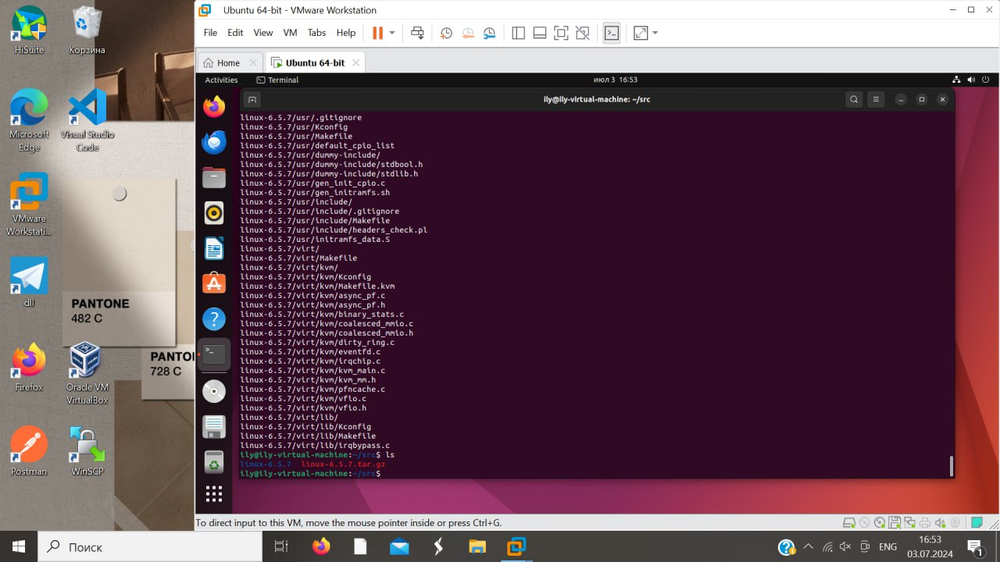
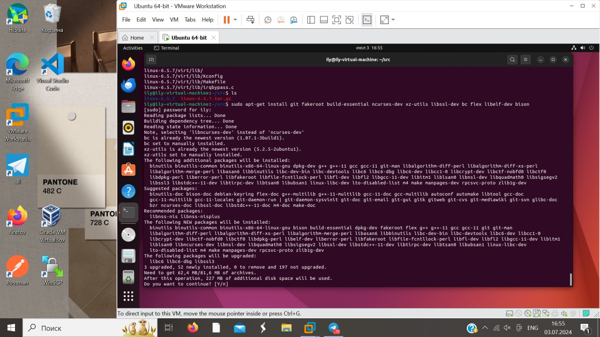
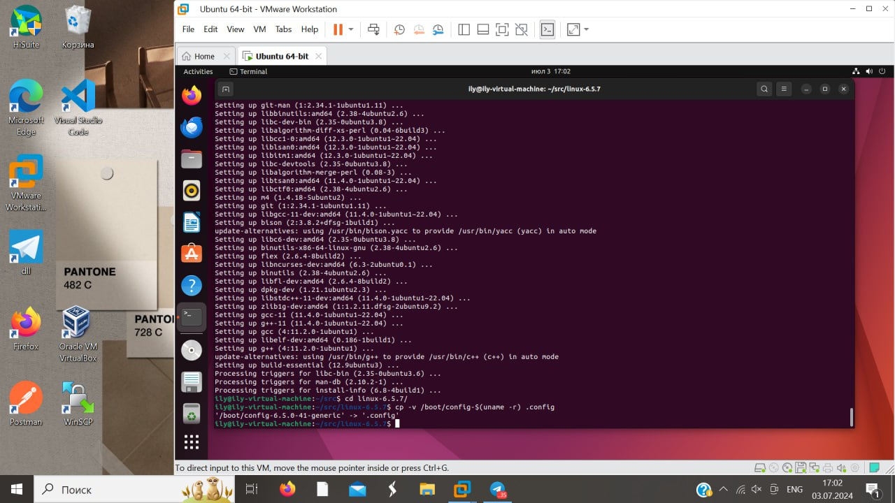
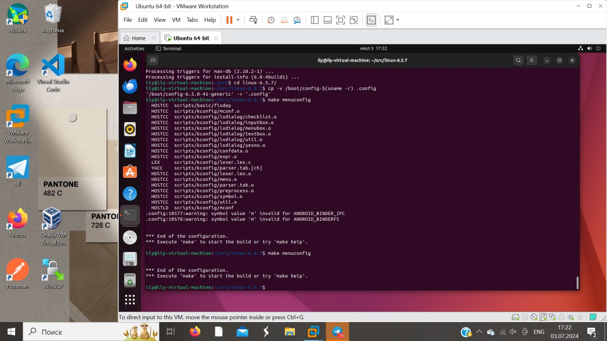
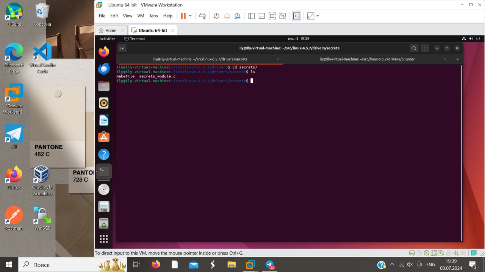
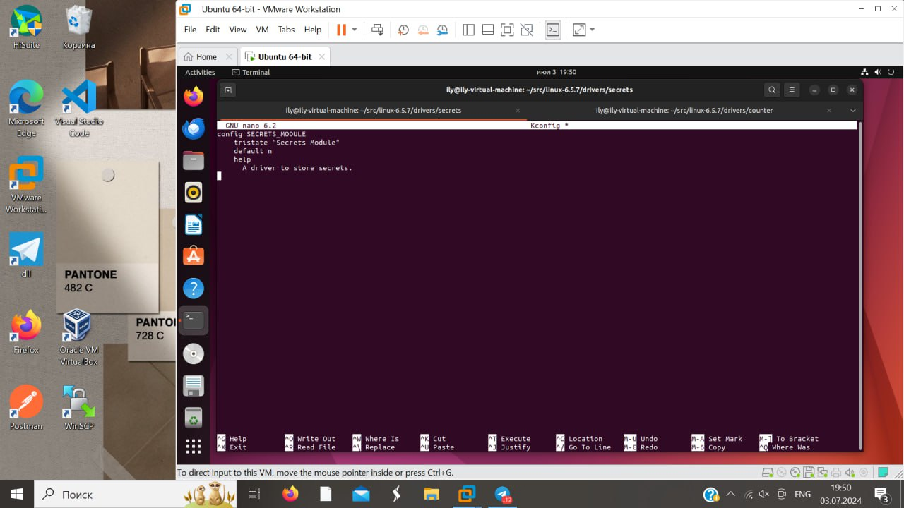
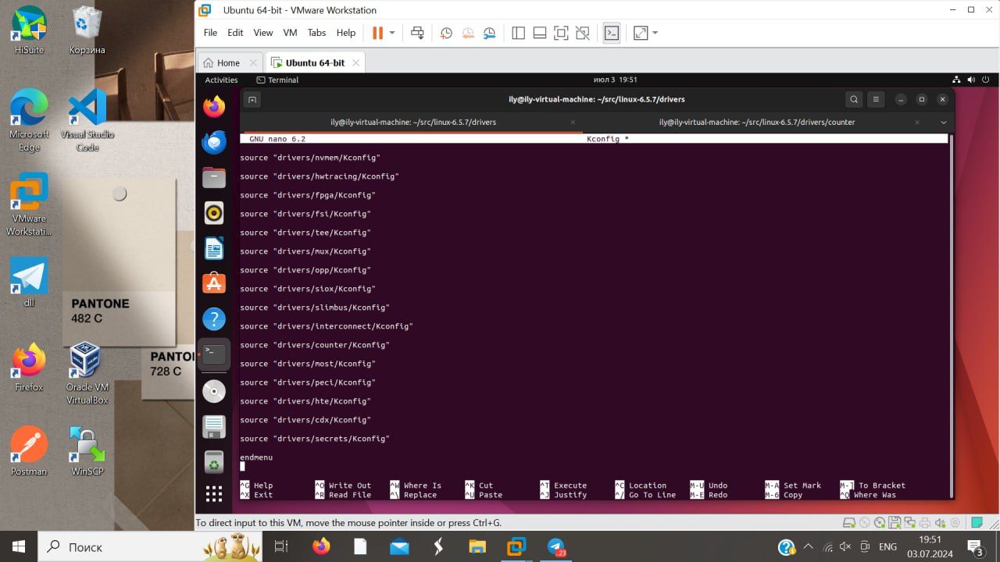
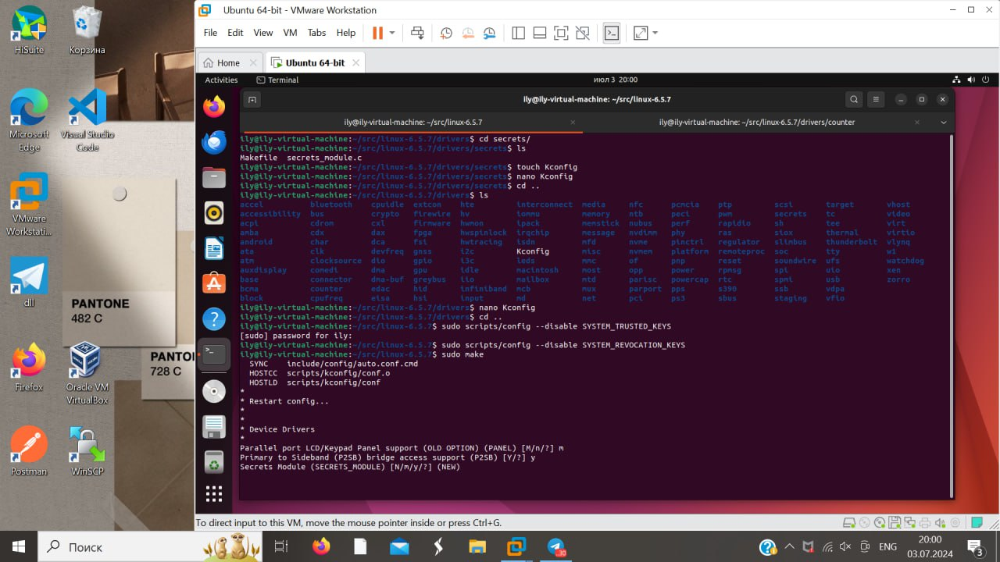

# INT-13 OS Журнал работы. Насибуллина Ильсия

# Введение

## Цель работы

Целью данного проекта является разработка модуля ядра Linux для хранения секретов пользователя с использованием файловой системы procfs. Драйвер позволяет пользователям записывать, читать и удалять секретные данные при помощи уникальных идентификаторов.

## Задачи и план работы

Первым делом я построила план работы:

1. Исследование темы и поиск статей
2. Разработка модуля ядра
    1. Создание специального файла в procfs
    2. Имплементация операции записи
    3. Имплементация операции чтения
    4. Имплементация операции удаления
3. Написание Makefile для запуска драйвера
4. Написание user-space программы для работы пользователя с драйвером
5. Сборка ядра с новым модулем и добавление поддержки KASAN
6. Анализ ошибок в коде

Помимо вышеперечисленных пунктов я буду вести публичный репозиторий на Github с регулярными коммитами и описанием к ним.

# Практика

## Исследование темы и поиск статей

Для более глубокого понимания поставленной задачи и формирования идеи решения я изучила несколько статей. Больше всего понять процесс разработки модуля ядра мне помогли эти статьи:

https://habr.com/ru/articles/343828/

https://habr.com/ru/companies/timeweb/articles/680850/

Далее я изучила статьи, посвященные написанию драйверов для создания файлов в procfs. Среди них наибольшую пользу для меня принесли следующие руководства:

https://embetronicx.com/tutorials/linux/device-drivers/procfs-in-linux/#Remove_Proc_Entry

https://devarea.com/linux-kernel-development-creating-a-proc-file-and-interfacing-with-user-space/

На основе объяснений из этих статей я сформировала свое собственное виденье моего будущего драйвера и приступила к разработке.

## Разработка

Ссылка на Github репозиторий: [https://github.com/IlsiyaNasibullina/LinuxKernelSecretsModule/tree/main](https://github.com/IlsiyaNasibullina/LinuxKernelSecretsModule/tree/main)


Весть процесс разработки и историю коммитов можно отследить в открытом Github репозитории. 

Также хочу отметить по процессу разработки и истории коммитов: изначально я написала отдельную функцию для удаления секрета в коде драйвера. Однако при написании программы для user-space я столкнулась с проблемой, что не знаю, как вызвать в драйвере функцию удаления. Поэтому я приняла решение добавить функцию удаления в код функции записи. Если программа из пользовательского пространства отправляет драйверу запрос с префиксом “delete:”, то драйвер выполняет удаление секрета, иначе записывает секрет и назначает ему уникальный идентификатор.

## Сборка и тестирование

В процессе сборки ядра с драйвером я опиралась на материал статей:

https://wiki.merionet.ru/articles/poshagovoe-rukovodstvo-kak-sobrat-yadro-linux-s-nulya

https://www.cyberciti.biz/tips/compiling-linux-kernel-module.html

https://wiki.archlinux.org/title/Compile_kernel_module

Первым шагом я скачала исходный код ядра Linux. Изначально на моей виртуальной машине была установлена версия 6.5.0, я выбрала для скачивания версию 6.5.7.


Далее я распаковала файл с исходным кодом при помощи команды:

```bash
tar xvf linux-6.5.7.tar.xz
```


Также установила необходимые пакеты используя команду:

```bash
sudo apt-get install git fakeroot build-essential ncurses-dev xz-utils libssl-dev bc flex libelf-dev bison
```


Затем я скопировала существующий файл конфигурации с помощью команды:

```bash
cp -v /boot/config-$(uname -r) .config
```


Для тестирования своего драйвера я буду использовать KASAN. Для его активации я включила соответствующую опцию в menuconfig. В меню я перешла при помощи команды:

```bash
make menuconfig
```



Следующим шагом я перешла к добавлению своего драйвера. В директории исходного кода я перешла в папку `drivers` и создала папку `secrets` для своего драйвера.


А затем переместила туда исходный код драйвера и Makefile.


Затем я приступила к написанию Kconfig файлу для драйвера. В него я добавила следующие строки:

```bash
config SECRETS_MODULE
    tristate "Secrets Module"
    default n
    help
      A driver to store secrets.
```

Описание строк файла:

- config SECRETS_MODULE - определение новой конфигурации с именем `SECRETS_MODULE`
- tristate "Secrets Module" - указание, что опция `SECRETS_MODULE` может иметь три состояния: `y`, `m`, или `n`.
- default n - устанавливает значение по умолчанию как `n`
- help - раздел справки для опции `SECRETS_MODULE`
- A driver to store secrets. - краткое описание драйвера


Далее я отредактировала Kconfig файл и добавила в него путь нового драйвера.


Затем я перешла к компиляции ядра при помощи команды:

```bash
sudo make
```


Несмотря на мой предыдущий опыт компиляции ядра, в этот раз я столкнулась с рядом проблем. В процессе компиляции возникла следующая ошибка:

```bash
arch/x86/kvm/x86.c: In function ‘kvm_arch_vm_ioctl’:
arch/x86/kvm/x86.c:7099:1: error: the frame size of 1208 bytes is 
													larger than 1024 bytes [-Werror=frame-larger-than=]
 7099 | }
      | ^
cc1: all warnings being treated as errors
make[4]: *** [scripts/Makefile.build:243: arch/x86/kvm/x86.o] Error 1
make[3]: *** [scripts/Makefile.build:480: arch/x86/kvm] Error 2
make[2]: *** [scripts/Makefile.build:480: arch/x86] Error 2
make[1]: *** [/home/ily/src/linux-6.5.7/Makefile:2034: .] Error 2
make: *** [Makefile:234: __sub-make] Error 2
```

Для решения этой проблемы я обратилась к следующим ресурсам:

https://forums.debian.net/viewtopic.php?t=65980

https://stackoverflow.com/questions/9415477/werror-frame-larger-than-error

Следуя рекомендациям, я отключила конфигурацию: `CONFIG_FRAME_WARN`.

Кроме того, возникла еще одна ошибка:

```bash
scripts/Makefile.build:41: drivers/Makefile: No such file or directory
make[3]: *** No rule to make target 'drivers/Makefile'.  Stop.
make[2]: *** [scripts/Makefile.build:480: drivers] Error 2
make[1]: *** [/home/ily/src/linux-6.5.7/Makefile:2034: .] Error 2
make: *** [Makefile:234: __sub-make] Error 2
```

Эта ошибка возникла из-за случайного удаления неверного файла при добавлении драйвера, что потребовало исправления и повторной компиляции. К сожалению, мне не удалось завершить компиляцию до дедлайна.

Для завершения задания следующие мои шаги были бы:

1. Компиляция user-space программы при помощи команды:
`gcc -o user_space user_space.c`
2. Загрузка моего драйвера в ядро при помощи `insmod`
3. Запуск user-space программы при помощи команды:
`./secrets_test`
4. Просмотр и анализ результатов KASAN

# Результаты

В рамках выполнения проекта я разработала и частично протестировала модуль ядра Linux для хранения пользовательских секретов с использованием файловой системы procfs. Основные этапы разработки включали создание специального файла в procfs, реализацию операций записи, чтения и удаления секретов, а также написание Makefile, user-space программы, Kconfig файла для драйвера и модификация Kconfig файла исходного кода ядра.

К сожалению, из-за возникших проблем и ограниченного времени мне не удалось завершить компиляцию и провести полное тестирование до дедлайна. Однако это задание дало мне ценный опыт в разработке драйверов, что значительно расширило мои знания и позволило глубже понять внутреннее устройство операционных систем.